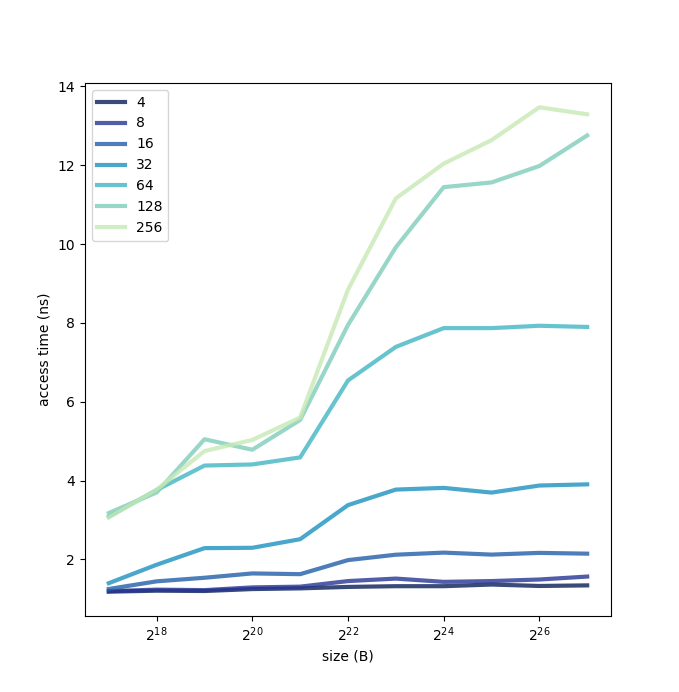

# Лабораторная работа №12

>  Проанализируйте cache.c  и с ее использованием исследуйте параметры кэша на вашем компьютере. Для этого 
>  1. постройте графики времени доступа как функции длины массива, шага выборки и размера буфера. 
>  2. на их основе сформулируйте обоснованные гипотезы о  размере кэша, размере блока, наличию кэша более высокого уровня. 
>  3. сравните свои оценки с реальными значениями, полученными через вызов системных функций или из технического описания вашего компьютера.

График:



Как видно из графика, стремительный рост access time происходит на 2^22 B, что примерно равно 4 мегабайтам.
Из этого можно предположить, что размер кэша -- 4Мб. На размере блока выше 64 байт происходит увеличение access time,
что может быть связано с тем, что физический размер блока -- 64 байта. Также наблюдаются ускорения при размере 2^20 и 
2^21, что может говорить о существовании некоторых кэшей размером в 1 и 2 Мб.

Вывод `cat /proc/cpuinfo`:
```text
...
cache size      : 3072 KB
bugs            : cpu_meltdown spectre_v1 spectre_v2 spec_store_bypass l1tf mds swapgs itlb_multihit srbds
bogomips        : 3792.26
clflush size    : 64
cache_alignment : 64
address sizes   : 39 bits physical, 48 bits virtual
...
```

Вывод `lscpu`:
```text
...
L1d cache:                       64 KiB
L1i cache:                       64 KiB
L2 cache:                        512 KiB
L3 cache:                        3 MiB
Vulnerability Itlb multihit:     KVM: Mitigation: Split huge pages
Vulnerability L1tf:              Mitigation; PTE Inversion; VMX conditional cache flushes, SMT vulnerable
Vulnerability Mds:               Mitigation; Clear CPU buffers; SMT vulnerable
Vulnerability Meltdown:          Mitigation; PTI
Vulnerability Spec store bypass: Mitigation; Speculative Store Bypass disabled via prctl and seccomp
Vulnerability Spectre v1:        Mitigation; usercopy/swapgs barriers and __user pointer sanitization
Vulnerability Spectre v2:        Mitigation; Full generic retpoline, IBPB conditional, IBRS_FW, STIBP conditional, RSB filling
Vulnerability Srbds:             Mitigation; Microcode
Vulnerability Tsx async abort:   Not affected
...
```

Исходя из этих данных, можно предположить, что в связи с патчами для устранения уязвимостей процессора
(Spectre, Meltdown, L1TF и прочие) график может не вполне корректно отражать реальное положение дел.

Но выводы оказались достаточно приближены к действительности: мы видим два L1-кэша размера 64 Кб (не видно
на графике, т.к. 2^16 Б меньше левой границы графика), L2-кэш размера 512 Кб (2^19 Б) и L3-кэш размера 3 Мб
(~2^(21.6) Б).
