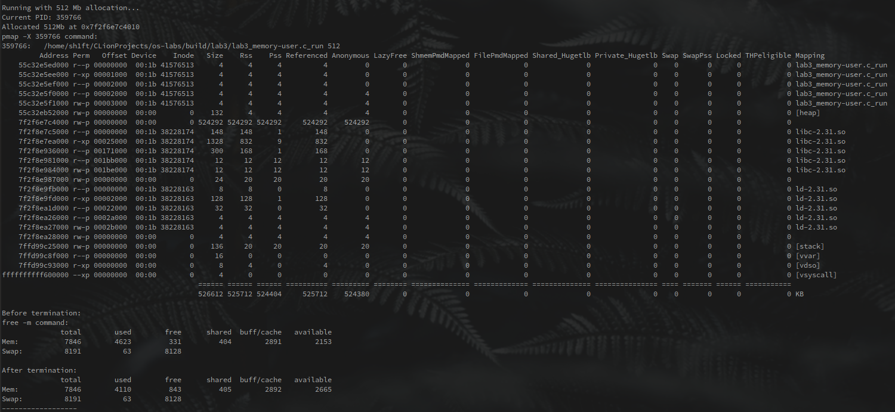

# Лабораторная работа №3

Были рассмотрены аллокации памяти размером 1, 16, 128 и 512 Мб.

Для выполнения заданий 4 и 3 был использован скрипт для оболочки bash, запускаемый точно так же, как и остальные 
лабораторные: `./run_lab.sh lab3` из директории со всеми работами. 

Он запускает программу [memory-user.c](memory-user.c) из первого задания с заданным объёмом памяти на выделение. 
Через 3 секунды запускается `pmap` для исследования распределения памяти, затем `free`. После этого исполняется 
`kill`, memory-user завершает работу. Запускаются те же `pmap` и `free` для сравнения.

Задержка 3 секунды после вызова `kill` необходима для того, чтобы система успела освободить память. При выделении 
2048 Мб память успевает высвобождаться лишь наполовину.

Ниже можно увидеть вывод скрипта для разных объёмов выделенной памяти:

**1 Mb:**

**16 Mb:**

**128 Mb:**

**512 Mb:**
