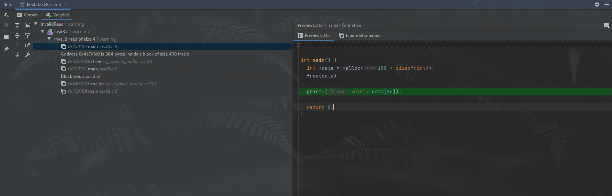

# Лабораторная работа №4

## Задание 1

Было выяснено, что если не инициализировать глобальные (статические) переменные, 
то порядок их расположения в памяти не определён. На trunk-версии GCC глобальные 
переменные располагаются в памяти в порядке их объявления. На trunk-версии Clang 
статические переменные располагаются в порядке их использования. 

Обратный порядок расположения переменных на стеке соблюдается только при компилировании 
с помощью Clang. (Проверено на GCC 9.3.0, GCC 6.5.0, Clang 10.0.0)

Если выделять 256 Кб и выше, то память выделяется в mmap-области.

Адрес указателя можно получить с помощью оператора "амперсанд": `&pointer`.

`&p` вернёт адрес, где лежит указатель, в то время как `p` вернёт сам указатель.

## Задание 2

`name` будет перезаписан после второго вызова `scanf()`, но если второй ввод строки
будет меньше, чем первый, то в памяти останется часть первого ввода (с учётом нуль-терминала).

При попытке записи в `name1` (`name1[0]=name1[3]`) программа даст сигнал SIGSEGV. Согласно 
стандарту, запись в переменные типа `char* a = "abc"` вызывает неопределённое поведение.
Но GCC хранит переменные, проинициализированные подобным образом, в секции `.rodata`.

## Задание 3

Разыменовывание нулевого указателя даёт неопределённое поведение. Как правило, это аварийное
завершение программы. В качестве примера были использованы получение значения по адресу 0x0 
и вызов функции по тому же адресу. Второй пример вызывает аварийное завершение программы не 
на всех платформах -- на AVR-микроконтроллерах, например, это вызовет перезагрузку.

## Задание 4

GDB остановится на сигнале SIGSEGV, в момент разыменовывания. Для получения значения по адресу
0x0 вывод будет выглядеть так:
```text
Program received signal SIGSEGV, Segmentation fault.
0x0000555555555129 in main () at /home/sh1ft/CLionProjects/os-labs/lab4/null.c:25
25        int a = *p;
```

Для вызова по нулевому адресу вывод будет следующим:
```text
Program received signal SIGSEGV, Segmentation fault.
0x0000000000000000 in ?? ()
```

Стоит обратить внимание, что для второго случая был выведен лишь адрес аварийного завершения
работы, так как для неизвестной функции по этому адресу компилятор не сгенерировал символы 
отладки.

## Задание 5

Valgrind с ключами `--leak-check=yes` сообщит, что программа попыталась обратиться к адресу, 
не находящемуся в mapped-области, укажет номер строки в файле, где это произошло. Также Valgrind
выведет, что утечек памяти в программе нет, и завершит работу с кодом SIGSEGV.

## Задание 6

Valgrind с ключами `--vgdb-error=0 --leak-check=yes` даст возможность подключить отладчик GDB.
После присоединения к процессу Valgrind (`target remote | /usr/lib/valgrind/../../bin/vgdb`)
программа будет приостановлена на точке входа `_start`. Ввод команды `continue` продолжит 
дальнейшее исполнение программы. Также можно поставить брейкпоинт на определённую строчку кода 
командой `break <srcfile>:<lineno>`, условный -- `break <srcfile>:<lineno> if <condition>`.
Программа без освобождения памяти успешно завершит работу, не вызвав остановки в отладчике,
но Valgrind заметит, что был утерян один блок памяти.

## Задание 7

Ошибка в коде видна невооружённым глазом -- выход за границы массива. Но программа успешно завершит
работу во всех случаях, за исключением граничных случаев, когда по адресу сразу после массива идёт
другая страница памяти. Но Valgrind следит за памятью приложения строже, чем операционная система --
некорректное обращение к памяти будет сразу замечено, о чём будет сообщено:
```text
==2088068== Invalid write of size 4
==2088068==    at 0x109159: main (task7.c:7)
==2088068==  Address 0x4a7c1d0 is 0 bytes after a block of size 400 alloc'd
==2088068==    at 0x483977F: malloc (vg_replace_malloc.c:309)
==2088068==    by 0x10914A: main (task7.c:6)
```

## Задание 8

Use-After-Free -- классическая ошибка при работе с динамической памятью. Они не всегда заметны, 
особенно если программа успешно выполняется в большинстве случаев (как в этом, например). К 
счастью, Valgrind определяет и такие ошибки. В IDE CLion встроена графическая обёртка для данного 
инструмента, которая и была использована при выполнении этого задания.

